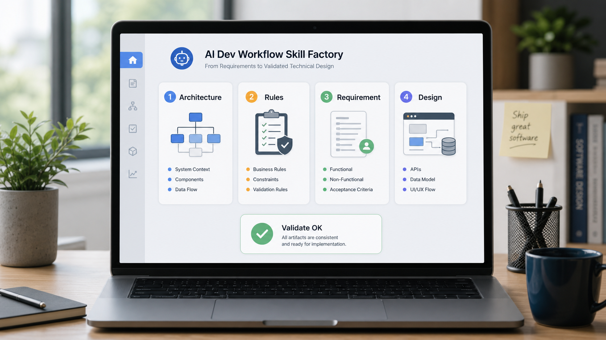
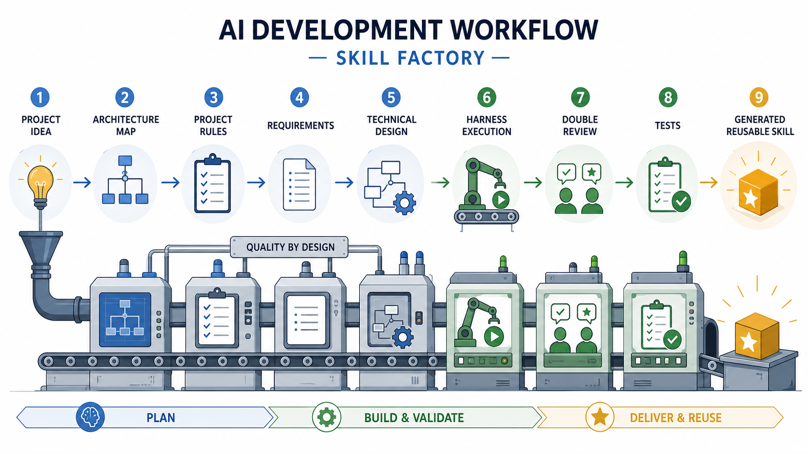
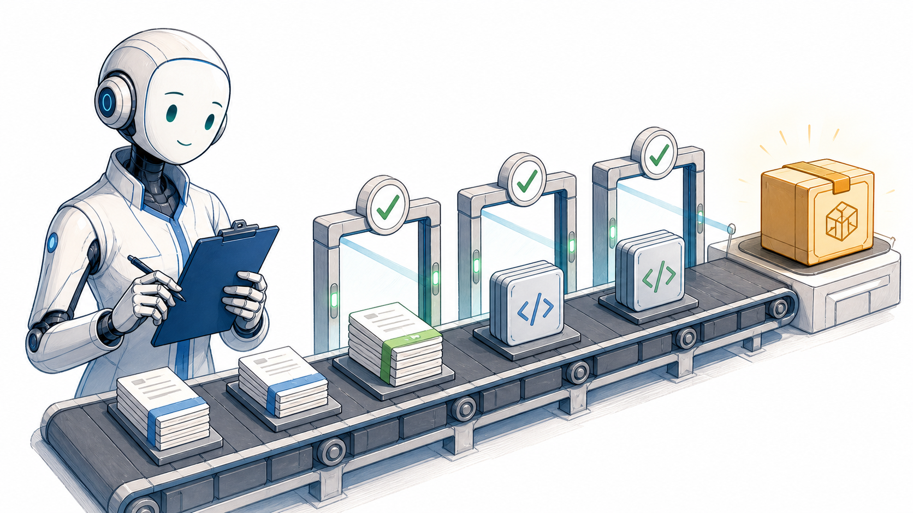
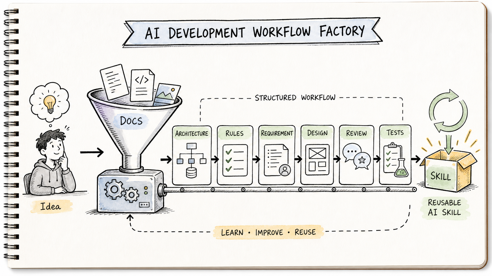

# AI Dev Workflow Skill Factory

把“让 AI 自由写代码”改造成“让 AI 按文档跑受控流水线”的 GitHub 项目模板。



本项目不是安装器，也不会自动修改本机 Codex、Claude Code 或 Cursor 配置。它提供一套可复制、可审阅、可继续改造的 workflow orchestrator skill，用来引导用户从自己的项目、团队规则和开发痛点出发，生成项目专属的 AI 自动化开发工作流。

它适合 GPT、Codex、Claude Code、Cursor 等 AI 编程环境：模型负责阅读、追问、生成和校验；工作流负责设边界、留产物、等确认、防跑偏。

## 来源思路

本项目结构参考 X 文章“程序员从零搭建 AI 自动化开发工作流”的核心链路：

```text
项目摸底
→ 架构文档
→ 项目规则
→ 需求 skill
→ 技术文档 skill
→ 代码生成 skill / harness
→ Bug 解决 skill
→ 双 Review
→ 测试方案
→ Git / SVN 个性化
→ 持续迭代
```

核心原则是：前期把关、文档先行、人工确认、harness 受控执行、多 Agent 协作、双 Review、测试闭环、持续复盘。

原帖入口：[https://x.com/longlongsongs/status/2063143686016319736](https://x.com/longlongsongs/status/2063143686016319736)

## 视觉导览

### 1. 流程图：把自由发挥变成受控流水线



这张图表达项目主线：从 project idea 进入 architecture map、project rules、requirements、technical design，再经过 harness execution、double review、tests，最后产出 generated reusable skill。

### 2. 示例图：一次完整运行会留下哪些产物


示例图展示一个项目运行后的核心文件：Architecture、Rules、Requirement、Design 和 Validate OK。这个项目强调的不是“AI 写得快”，而是“每一步都可检查”。

### 3. 拟人化图：AI 是工程队友，不是自由发挥的黑箱



拟人化图把 AI 画成拿着检查板的工程队友：它可以执行，但每个包都要经过需求、规则、代码、Review 的闸门。

### 4. 手绘图：把自己的想法生成项目专属 workflow skill



手绘图表达最终目标：用户给出一个想法，经过文档漏斗、规则、Review、测试和复盘，最后得到一个可复用的项目专属 skill。

## 项目结构

```text
ai-dev-workflow-skill-factory/
  README.md
  assets/
  skills/
    ai-dev-workflow-factory/
      SKILL.md
      references/
      templates/
      scripts/
  examples/
    demo-project-workflow/
  docs/
```

## 怎么使用

1. 把 `skills/ai-dev-workflow-factory/` 复制到你的 skill 仓库或项目文档库。
2. 在 AI 编程工具里触发 `ai-dev-workflow-factory`。
3. 用一个项目想法、粗需求、旧项目目录或团队痛点作为输入。
4. 可选：先初始化一套可填写的 workflow 产物。

```bash
npm run init -- --target work/my-project-workflow
```

5. 按状态机生成并确认以下产物：

```text
project-brief.md
ARCHITECTURE.md
PROJECT_RULES.md
REQUIREMENT.md
TECH_DESIGN.md
IMPLEMENTATION_PLAN.md
REVIEW_REPORT.md
workflow-run.json
generated-workflow-skill.md
```

6. 运行验收脚本，失败就回到对应状态修正。

也可以在仓库根目录直接运行：

```bash
npm test
```

这会验证完整 demo，并确认 `examples/failure-cases/` 下的坏案例会被严格模式拦住。

更多校验细节见 [`docs/validation.md`](docs/validation.md)。
工具落地步骤见 [`docs/tooling.md`](docs/tooling.md)，维护路线见 [`docs/roadmap.md`](docs/roadmap.md) 和 [`docs/compatibility.md`](docs/compatibility.md)。

## 适用场景

- 老项目希望让 AI 先读懂架构再改代码。
- 团队想把隐性编码规矩显性化。
- 需求经常太粗，AI 容易脑补。
- 想把需求、技术方案、代码生成、Bug 修复、Review 和测试串成稳定流水线。
- 想为不同项目生成类似 `wechat-content-workflow` 的总控 workflow skill。

## 不适用场景

- 一次性小修，不需要长期工作流。
- 没有项目上下文，也不愿意人工确认需求和技术方案。
- 期待 AI 自动提交、发布、操作生产环境。
- 想跳过测试和 Review 直接批量改代码。

## 安全边界

- 默认只生成文档和本地代码改动建议。
- 不自动提交、不推送、不部署。
- 不调用生产 API，不提交表单，不上传敏感信息。
- 涉及删除、批量修改、数据库结构变更、生产环境操作时，必须提前人工确认。

## 验收

```bash
node "skills/ai-dev-workflow-factory/scripts/validate-ai-dev-workflow.mjs" \
  --root "examples/demo-project-workflow" \
  --require-review \
  --require-run \
  --strict
```

验收失败不能把 workflow 标记为完成。

严格模式会检查：

- `workflow-run.json` 的状态、确认记录、artifact 路径和 review/test 状态。
- `REVIEW_REPORT.md` 是否包含双 Review、最终通过状态和证据或未测风险。
- 缺少人工确认、Review 失败、测试失败或未记录测试风险时直接失败。

## 图片资产

项目内置 4 张 README 展示图：

| 文件 | 用途 |
| --- | --- |
| `assets/01-workflow-flowchart.png` | 流程图 |
| `assets/02-example-workspace.png` | 示例图 |
| `assets/03-personified-ai-teammate.png` | 拟人化图 |
| `assets/04-handdrawn-skill-factory.png` | 手绘图 |

更多说明见 [`docs/visual-guide.md`](docs/visual-guide.md)。
